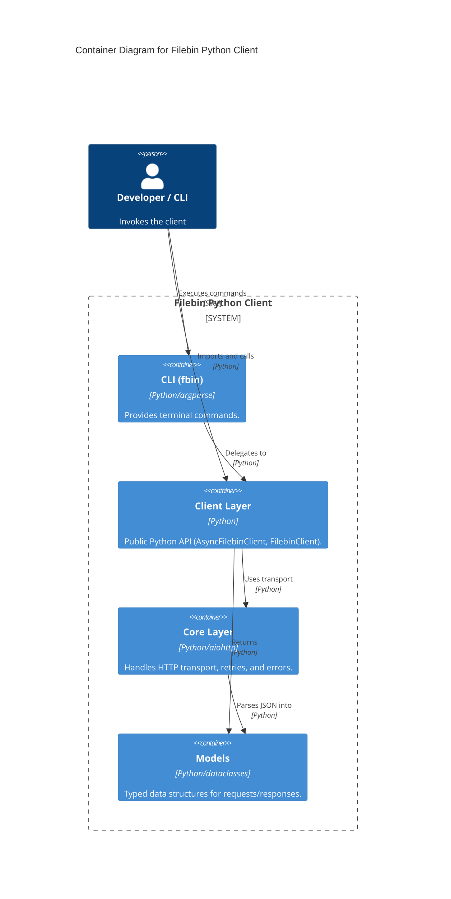

# Container Diagram

```mermaid
C4Container
    title Container Diagram for Filebin Python Client

    Person(user, "Developer / CLI", "Invokes the client")

    System_Boundary(sdk_boundary, "Filebin Python Client") {
        Container(cli, "CLI (fbin)", "Python/argparse", "Provides terminal commands.")
        Container(client, "Client Layer", "Python", "Public Python API (AsyncFilebinClient, FilebinClient).")
        Container(core, "Core Layer", "Python/aiohttp", "Handles HTTP transport, retries, and errors.")
        Container(models, "Models", "Python/dataclasses", "Typed data structures for requests/responses.")
    }

    Rel(user, cli, "Executes commands", "Shell")
    Rel(user, client, "Imports and calls", "Python")

    Rel(cli, client, "Delegates to", "Python")
    Rel(client, core, "Uses transport", "Python")
    Rel(client, models, "Returns", "Python")
    Rel(core, models, "Parses JSON into", "Python")
```
