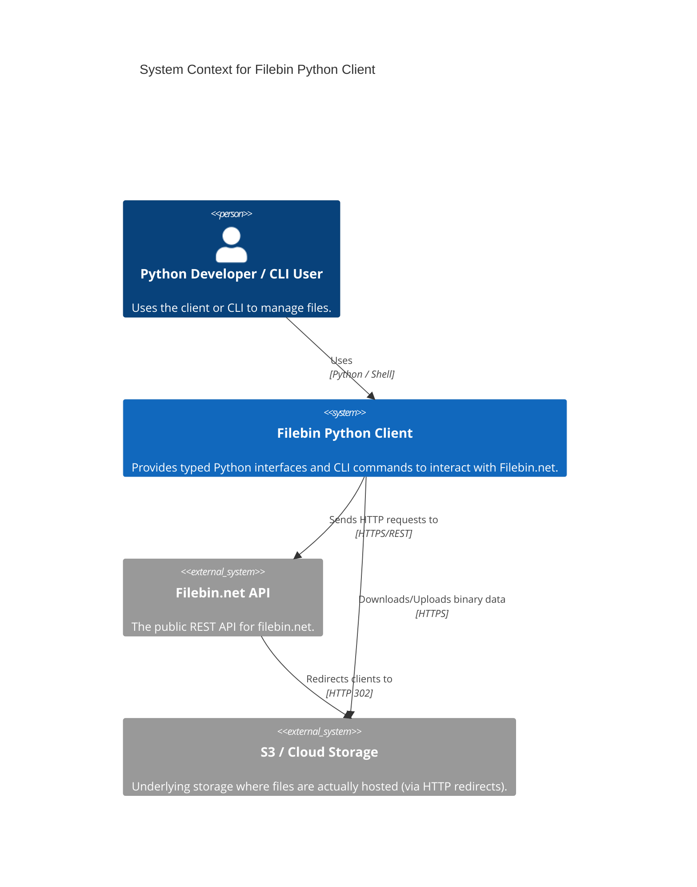

# System Context

```mermaid
C4Context
    title System Context for Filebin Python Client

    Person(user, "Python Developer / CLI User", "Uses the client or CLI to manage files.")

    System(sdk, "Filebin Python Client", "Provides typed Python interfaces and CLI commands to interact with Filebin.net.")
    System_Ext(filebin_api, "Filebin.net API", "The public REST API for filebin.net.")
    System_Ext(s3, "S3 / Cloud Storage", "Underlying storage where files are actually hosted (via HTTP redirects).")

    Rel(user, sdk, "Uses", "Python / Shell")
    Rel(sdk, filebin_api, "Sends HTTP requests to", "HTTPS/REST")
    Rel(sdk, s3, "Downloads/Uploads binary data", "HTTPS")
    Rel(filebin_api, s3, "Redirects clients to", "HTTP 302")
```
